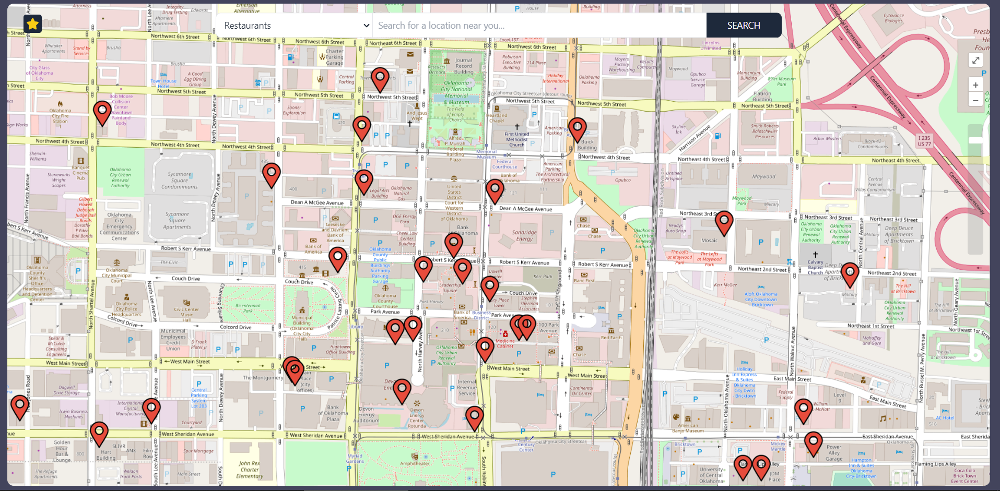
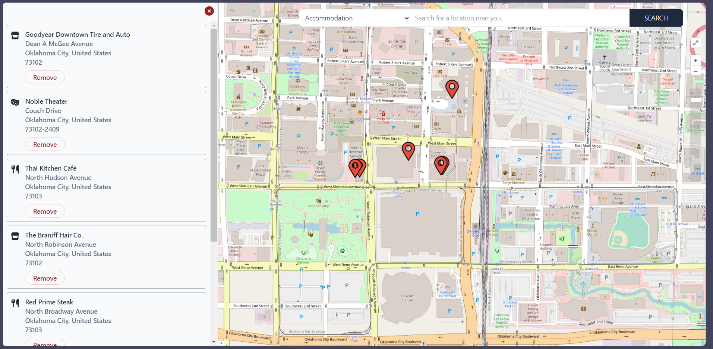

# React Typescript Favorite Locations App

## Table of contents

- [Introduction](#introduction)
- [Demo](#demo)
- [Features](#features)
- [Technology](#technology)
- [Run](#run)
- [Testing](#testing)
- [License](#license)

## Introduction

An application that allows users to look for locations from Geoapify API and filter them based on the category or name and add them to a favorites list.

## Demo




This application is deployed on Github Pages and can be accessed through the following link:

[React Typescript Favorite Locations App](https://maryamaljanabi.github.io/react-ts-favorite-locations/)

## Technology

The main technologies used to build this application are:

- Node.js version 16.15.1
- React.js version 18.2.0
- Tailwind CSS version 3.1.8
- Openlayers, a JavaScript library for displaying map data in web browsers as slippy maps, version 7.0.0
- Typescript version 4.7.4
- Jest version 28.1.3

## Features

This project focuses on using React Typescript with OpenLayers and Geoapify to allow users to add their favorites locations on map. The CSS styling is mainly done with Tailwind CSS. The following points summarize the application features.

- Users will be able to see a map when they open the app and there will be a pin in the middle of the map with their location. The browser will prompt the user to allow sharing location, if this permission is not granted, the user pin will not show on the map.
- Users can search for nearby restaurants, markets, entertainment facilities, or accommodations and add them to their favorites list. The favorites icon will float on the map and when clicked, it will show a side menu with all the favorite locations a user has added.
- Users can star a location to add it to favorites and when clicking on the star icon again, it will be removed from favorites.
- Users can remove a location from favorites by clicking on the trash icon in the side list.
- This project does not require login or backend/database to function.
- Since there is no database involved, the favorites information for each user will be stored in the local storage of the browser.

## Run

In the root directory of the application, run the following command to install the tequired packages:

```
npm install
```

In order to use Geoapify, you need to create an account there, create a `.env` file at the root directory of the application, and add the API key that you will get from your Geoapify account there under the name `REACT_APP_GEOAPIFY_API_KEY`.

Then to start the application, run the following command then go to `localhost:3000` to view the home page.

```
npm start
```

## Testing

There are multiple unit tests written for this application using Jest and React Testing Library. You can run the unit tests using:

```
npm run test
```

## License

[](http://badges.mit-license.org)

- MIT License
- Copyright 2022 © [Maryam Aljanabi](https://github.com/maryamaljanabi)
